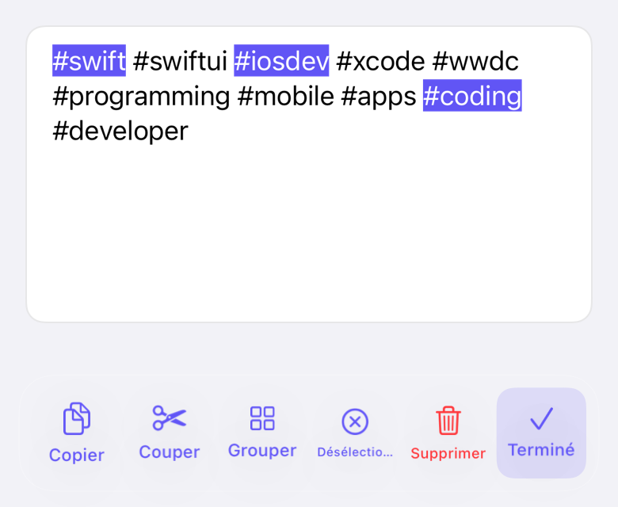

# TapTagKit

**Hashtags you can actually tap.** A `UITextView` subclass that turns every `#tag` into a target: tap one to light up all its twins, then act on the whole set from a toolbar.

[](https://github.com/A-bv/TapTagKit/actions/workflows/ci.yml)


<p align="center">
  
</p>

## Install

Swift Package Manager:

```swift
.package(url: "https://github.com/A-bv/TapTagKit", from: "2.0.0")
```

## 60-second start

```swift
let textView = TapTextView()
navigationItem.rightBarButtonItem = textView.makeTapTextViewButton()
```

That's the whole setup. Tapping the button starts a session; the action toolbar
shows and hides itself — no navigation-controller wiring, no delegate dance. Or
drive it yourself with `beginSelection()` / `endSelection()`.

### SwiftUI

```swift
@State private var text = "Try #swift and #swiftui"
@State private var isSelecting = false

var body: some View {
    VStack {
        TapTagView(text: $text, isSelecting: $isSelecting)
        Button(isSelecting ? "Done" : "Select hashtags") {
            isSelecting.toggle()
        }
    }
}
```

`TapTagView` is a native SwiftUI adapter backed by the same UIKit text engine.
The text and selection-session state stay synchronized through bindings.

## What you get

<p align="center">
  
</p>

- **One tap, every match** — selecting `#swift` highlights it everywhere at once.
- **Self-managing captioned bar** — copy · cut · group-to-top · deselect · delete · done, each with a label; appears and hides itself.
- **Tidies up on entry** — duplicate and invalid hashtags are removed when a session starts (toggle with `removesDuplicatesOnSelection`).
- **Safe destructive actions** — Delete asks for confirmation; Done finishes immediately.
- **Drive it in code** — `selectTag`, `deselectTag`, `groupSelectedTags`, `cleanUpHashtags`, `selectedTagsInOrder`.
- **Yours to style** — highlight color and every label/caption via `Configuration` (localize once, used for the caption *and* VoiceOver).
- **Won't trample your text** — fonts, colors, and links survive highlighting; awkward tags like `#c++` are matched whole.

## Customize

```swift
var config = TapTextView.Configuration()
config.tagHighlightColor = .systemIndigo
config.accessibility.copyLabel = "Copier"   // localize any string
textView.configuration = config
```

## Under the hood

Selection state and all tag/text logic live in a UIKit-free `TagSelectionViewModel` (MVVM), so the rules are unit-tested without a single simulated view. History lives in the [CHANGELOG](CHANGELOG.md).

## Preview

Open `Sources/TapTagKit/Previews.swift` and switch on the canvas (**Editor › Canvas**) for a live, tappable demo. The animation above is reproducible — `Scripts/record-gif.sh` renders it to `Assets/demo.gif`.

## Requirements & license

iOS 15 · Swift 5.9 · [MIT](LICENSE).
