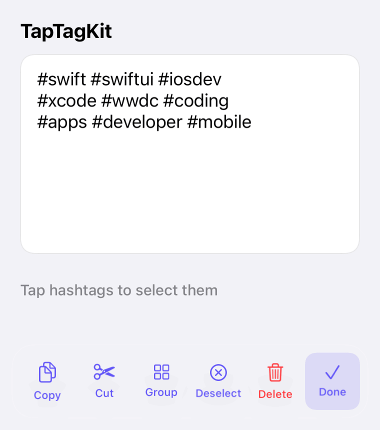

# TapTagKit

**Hashtags you can actually tap.** A `UITextView` subclass that turns every `#tag` into a target: tap one to light up all its twins, then act on the whole set from a toolbar.

[](https://github.com/A-bv/TapTagKit/actions/workflows/ci.yml)


<p align="center">
  
</p>

## Install

Swift Package Manager:

```swift
.package(url: "https://github.com/A-bv/TapTagKit", from: "4.0.0")
```

## 60-second start

```swift
let textView = TapTextView()
navigationItem.rightBarButtonItem = textView.makeTapTextViewButton()
```

That's the whole setup. Tapping the button starts a session; the action toolbar
shows and hides itself — no navigation-controller wiring, no delegate dance. Or
drive it yourself with `beginSelection()` / `endSelection()`.

### SwiftUI

```swift
@State private var text = "Try #swift and #swiftui"
@State private var isSelecting = false

var body: some View {
    VStack {
        TapTagView(text: $text, isSelecting: $isSelecting)
        Button(isSelecting ? "Done" : "Select hashtags") {
            isSelecting.toggle()
        }
    }
}
```

`TapTagView` is a native SwiftUI adapter backed by the same UIKit text engine.
The text and selection-session state stay synchronized through bindings.

## Customize

```swift
var config = TapTextView.Configuration()
config.tagHighlightColor = .systemIndigo
config.accessibility.copyLabel = "Copier"   // localize any string
textView.configuration = config
```

Labels, captions, and VoiceOver strings ship localized in **English and French** — override any of them through `Configuration`. Duplicate and invalid hashtags are tidied when a session starts (`removesDuplicatesOnSelection`). Tag matching is case-insensitive, so `#Sun` and `#sun` count as the same tag.

## Accessibility

VoiceOver support is built in, not bolted on:

- **Every hashtag is its own element.** During a session each `#tag` reads as a button; activating it (VoiceOver double-tap) toggles that tag exactly like a sighted tap.
- **Selection changes are spoken.** Selecting or deselecting posts an announcement — at high priority on iOS 17+, so a fast run of toggles isn't dropped mid-utterance.
- **Everything spoken is localizable** through `Configuration.accessibility`, including the announcement strings.

## Rich text survives every edit

Highlighting, grouping, deleting, and the start-of-session clean-up all operate on the *attributed* text, so caller-supplied fonts, colors, and links are preserved — only the tags themselves move or disappear. Tapping a tag in a long, scrolled text view also keeps the scroll position instead of snapping to the top.

## Under the hood

Selection state and all tag/text logic live in a UIKit-free `TagSelectionViewModel` (MVVM), so the rules are unit-tested without a single simulated view. History lives in the [CHANGELOG](CHANGELOG.md).

## Preview

Open `Sources/TapTagKit/Previews.swift` and switch on the canvas (**Editor › Canvas**) for a live, tappable demo. The animation above is reproducible — `Scripts/record-gif.sh` renders it to `Assets/demo.gif`.

## Requirements & license

iOS 15 · Swift 6.0 · [MIT](LICENSE).
